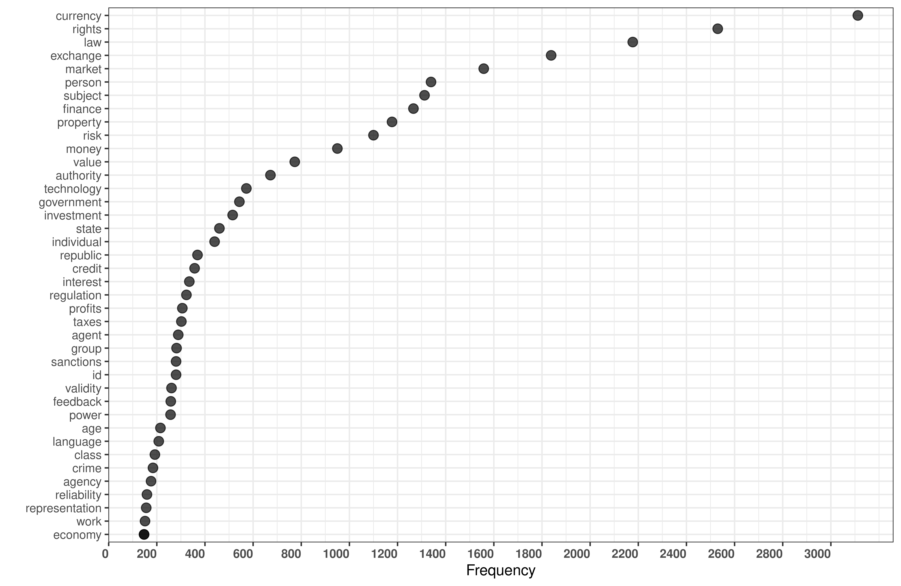

# Terms of Service of Cryptocurrency Agreements

**Reference:** Birbil, S.I. and Caliskan, K. (2020). Terms of service
agreements of 251 cryptocurrency exchanges representing 99.99% of
centralized data money transactions. GitHub Repository
https://github.com/sibirbil/TermsOfService

We would like to thank Sevde Ünal for research assistance.

## R Code

If you run the accompanying R code, you will produce the two figures
that are also used in the paper:

